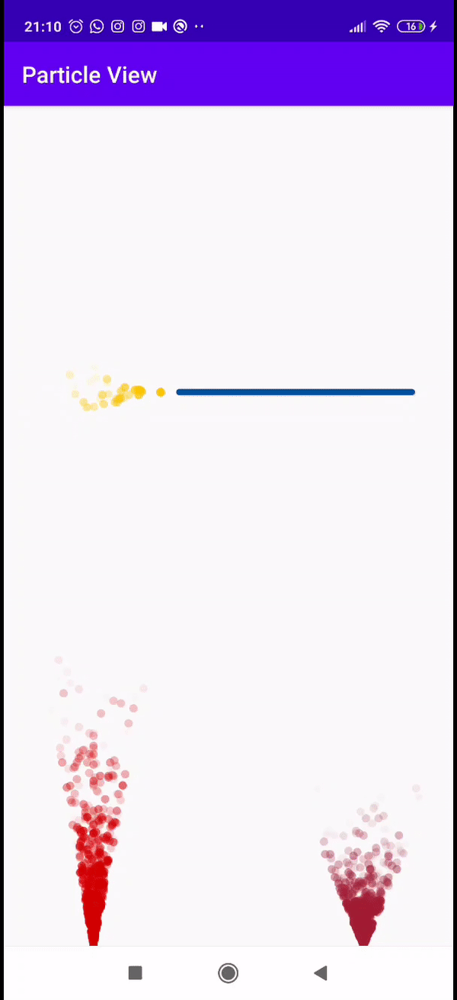

# particle animation

[](https://www.android.com)
[](https://android-arsenal.com/api?level=19)
[](https://jitpack.io/#kAvEh--/particle-view)

Android library for drawing particles and particle progress bar.

[]()

## Usage

1. Add it in your root build.gradle at the end of repositories:
```groovy
allprojects {
  repositories {
    ...
    maven { url 'https://jitpack.io' }
  }
}
```
2. Add the dependency to app build.gradle
```groovy
dependencies {
        implementation 'com.github.kAvEh--:particle-view:Tag'
}
```

### Particle Progress Bar
1. Insert `ParticleProgressBar` widget in your layout.
```xml
<com.kaveh.particle.ParticleProgressBar
        android:id="@+id/particlePB"
        android:layout_width="match_parent"
        android:layout_height="100dp"
        app:layout_constraintTop_toTopOf="parent" />
```
2. For customization:
```kotlin
        particlePB.setParticlesNum(35) // change number of active particle
        particlePB.setVelocity(minX, maxX, minY, maxY) // change direction of particle. Random between min and max
        particlePB.setLifeTime(300, 800) // change life time of particle
```

## Requirements
Android 4.4+ (API 19)

## Developed By
* Kaveh Fazaeli - <kaveh.fazaeli@gmail.com>

## License

    Copyright 2020 kAvEh--

    Licensed under the Apache License, Version 2.0 (the "License");
    you may not use this file except in compliance with the License.
    You may obtain a copy of the License at

       http://www.apache.org/licenses/LICENSE-2.0

    Unless required by applicable law or agreed to in writing, software
    distributed under the License is distributed on an "AS IS" BASIS,
    WITHOUT WARRANTIES OR CONDITIONS OF ANY KIND, either express or implied.
    See the License for the specific language governing permissions and
    limitations under the License.

